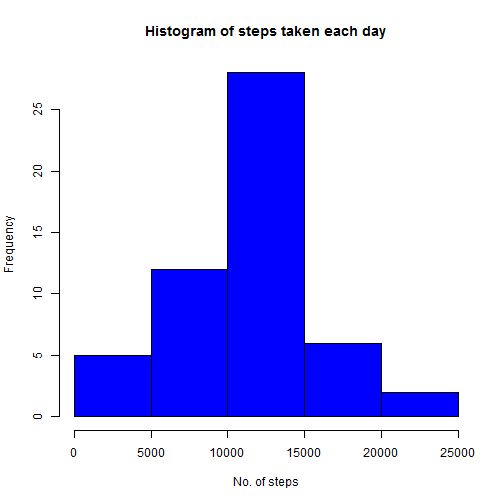
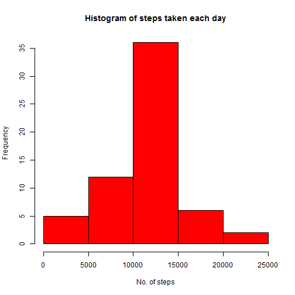
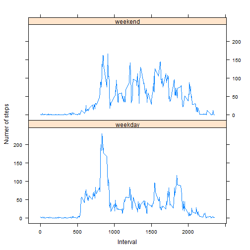

Reproducible Research: Peer Assessment 1
========================================================


```r
opts_chunk$set(echo = TRUE)
```


## Loading and pre-processing the data  
1. Load the data  
Assume that the data has been unzipped (i.e. "activity.csv") and saved to the working directory.
    
    ```r
    dat <- read.csv("activity.csv", colClasses = c("numeric", "Date", "numeric"))
    head(dat)
    ```
    
    ```
    ##   steps       date interval
    ## 1    NA 2012-10-01        0
    ## 2    NA 2012-10-01        5
    ## 3    NA 2012-10-01       10
    ## 4    NA 2012-10-01       15
    ## 5    NA 2012-10-01       20
    ## 6    NA 2012-10-01       25
    ```


## What is the mean total number of steps taken per day?
1. Make a histogram of the total number of steps taken each day
    
    ```r
    stepsperday <- tapply(dat$steps, dat$date, sum)
    hist(stepsperday, main = "Histogram of steps taken each day", xlab = "No. of steps", 
        col = "blue")
    ```
    
     


2. Calculate and report the mean and median total number of steps taken per day
    
    ```r
    mean(stepsperday, na.rm = TRUE)
    ```
    
    ```
    ## [1] 10766
    ```
    
    ```r
    median(stepsperday, na.rm = TRUE)
    ```
    
    ```
    ## [1] 10765
    ```


## What is the average daily activity pattern?
1. Make a time-series plot of the 5-minute interval and the average number of steps taken, average across all days
    
    ```r
    dailyactivity <- tapply(dat$steps, dat$interval, mean, na.rm = TRUE)
    plot(dailyactivity, type = "l", ylab = "Average no of steps", xlab = "Time interval")
    ```
    
     


2. Which 5-minute interval contains the maximum number of steps?
    
    ```r
    row.names(dailyactivity)[dailyactivity == max(dailyactivity)]
    ```
    
    ```
    ## [1] "835"
    ```


## Inputting missing values
1. Calculate and report the total number of missing values in the dataset.
    
    ```r
    sum(is.na(dat))
    ```
    
    ```
    ## [1] 2304
    ```


2. Devise a strategy for filling in all of the missing values in the dataset.  
Strategy: Replace missing values with the mean of that interval  

3. Create a new dataset with the missing data filled in  
New dataset stored in datnew
Mean retrieved from dailyactivity
    
    ```r
    datnew <- dat
    for (i in seq_len(length(dat$steps))) {
        if (is.na(dat$steps[i]) == "TRUE") {
            intreq <- as.character(dat$interval[i])
            valreq <- dailyactivity[intreq]
            datnew$steps[i] <- valreq
        }
    }
    head(datnew)
    ```
    
    ```
    ##     steps       date interval
    ## 1 1.71698 2012-10-01        0
    ## 2 0.33962 2012-10-01        5
    ## 3 0.13208 2012-10-01       10
    ## 4 0.15094 2012-10-01       15
    ## 5 0.07547 2012-10-01       20
    ## 6 2.09434 2012-10-01       25
    ```
    
    ```r
    sum(is.na(datnew))
    ```
    
    ```
    ## [1] 0
    ```


4. Make a histogram of the total number of steps taken each day and calculate and report the mean and median total number of steps taken per day.
    
    ```r
    newstepsperday <- tapply(datnew$steps, datnew$date, sum)
    hist(newstepsperday, main = "Histogram of steps taken each day", xlab = "No. of steps", 
        col = "red")
    ```
    
     
    
    ```r
    mean(newstepsperday, na.rm = TRUE)
    ```
    
    ```
    ## [1] 10766
    ```
    
    ```r
    median(newstepsperday, na.rm = TRUE)
    ```
    
    ```
    ## [1] 10766
    ```

        
Do these values differ from the estimates from the first part of the assignment?
- Yes

What is the impact of imputing missing data on the estimates of the total daily number of steps?
- The median increases

## Are there differences in activity patterns between weekdays and weekends?
1. Create a new factor variable in the dataset with two levels -- "weekday" and "weekend" indicating whether a given date is a weekday or weekend day.
    
    ```r
    datnew$weekday <- weekdays(datnew$date) == "Saturday" | weekdays(datnew$date) == 
        "Sunday"
    for (i in seq_len(length(datnew$weekday))) {
        if (datnew$weekday[i] == TRUE) {
            datnew$weekday[i] <- "weekend"
        } else {
            datnew$weekday[i] <- "weekday"
        }
    }
    datnew$weekday <- as.factor(datnew$weekday)
    ```


2. Make a panel plot containing a time series of the 5-minute interval (x-axis) and the average number of steps taken, averaged across all weekday days or weekend days (y-axis).  
Separate data for weekdays and weekends  
    
    ```r
    interval <- row.names(dailyactivity)
    
    datreq <- datnew[datnew$weekday == "weekday", ]
    steps <- tapply(datreq$steps, datreq$interval, mean)
    actweekday <- cbind(interval, steps, weekday = "weekday")
    
    datreq <- datnew[datnew$weekday == "weekend", ]
    steps <- tapply(datreq$steps, datreq$interval, mean)
    actweekend <- cbind(interval, steps, weekday = "weekend")
    
    groupedactivity <- as.data.frame(rbind(actweekday, actweekend))
    groupedactivity$interval <- as.numeric(as.character(groupedactivity$interval))
    groupedactivity$steps <- as.numeric(as.character(groupedactivity$steps))
    ```

Plot graph
    
    ```r
    require(lattice)
    ```
    
    ```
    ## Loading required package: lattice
    ```
    
    ```r
    xyplot(steps ~ interval | weekday, data = groupedactivity, layout = c(1, 2), 
        type = "l", xlab = "Interval", ylab = "Numer of steps")
    ```
    
     

