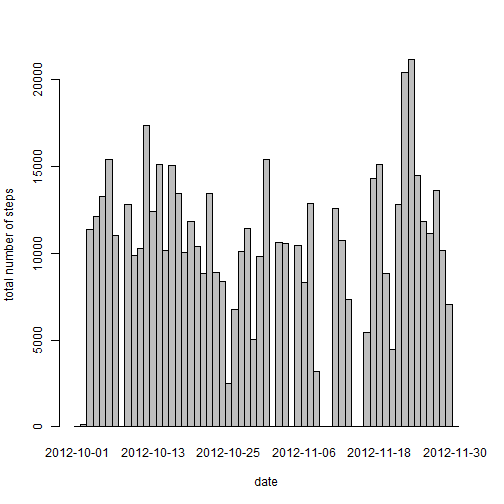
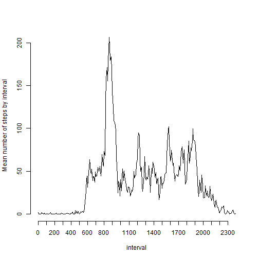
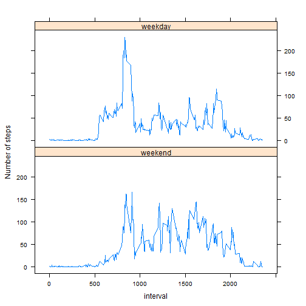

# Reproducible Research: Peer Assessment 1


## Loading and preprocessing the data

```r
dataTable <- read.csv("activity.csv")
dataTable$date <- as.Date(as.character(dataTable$date))
```


## What is mean total number of steps taken per day?


```r
totalStepsPerDay <- aggregate(dataTable$steps, list(date = dataTable$date), 
    sum, na.rm = TRUE)
barplot(totalStepsPerDay$x, space = 0, axes = TRUE, names.arg = totalStepsPerDay$date)
```

 

```r

meanTotalStepsPerDay <- mean(totalStepsPerDay$x, na.rm = TRUE)
meanTotalStepsPerDay
```

```
## [1] 9354
```

```r
medianTotalStepsPerDay <- median(totalStepsPerDay$x, na.rm = TRUE)
medianTotalStepsPerDay
```

```
## [1] 10395
```


## What is the average daily activity pattern?


```r
totalStepsPerInterval <- aggregate(dataTable$steps, list(interval = dataTable$interval), 
    mean, na.rm = TRUE)
with(totalStepsPerInterval, plot(1:dim(totalStepsPerInterval)[1], x, type = "l", 
    ylab = "Mean number of steps by interval", axes = FALSE))
with(totalStepsPerInterval, axis(2))
with(totalStepsPerInterval, axis(1, at = seq(1, dim(totalStepsPerInterval)[1], 
    12), lab = subset(interval, interval%%100 == 0)))
```

 

```r


intervalWithMaxSteps <- with(totalStepsPerInterval, interval[which.max(x)])
intervalWithMaxSteps
```

```
## [1] 835
```

## Imputing missing values


```r
countOfNAs <- sum(is.na(dataTable$steps))
countOfNAs
```

```
## [1] 2304
```

```r
dataTable2 <- dataTable
for (i in 1:length(dataTable$steps)) {
    if (is.na(dataTable$steps[i])) {
        dataTable2$steps[i] <- totalStepsPerInterval$x[totalStepsPerInterval$interval == 
            dataTable$interval[i]]
    }
}

totalStepsPerDay2 <- aggregate(dataTable2$steps, list(date = dataTable2$date), 
    sum, na.rm = FALSE)
par(mfrow = c(2, 1))
barplot(totalStepsPerDay$x, space = 0, axes = TRUE, names.arg = totalStepsPerDay$date)
barplot(totalStepsPerDay2$x, space = 0, axes = TRUE, names.arg = totalStepsPerDay2$date)
```

 

```r

meanTotalStepsPerDay2 <- mean(totalStepsPerDay2$x, na.rm = FALSE)
meanTotalStepsPerDay2
```

```
## [1] 10766
```

```r
medianTotalStepsPerDay2 <- median(totalStepsPerDay2$x, na.rm = FALSE)
medianTotalStepsPerDay2
```

```
## [1] 10766
```


The mean and the median are slightly affected by the filling of th missing values. The most affected value is the mean as it increases by more than 1400 units, which is more than 15% of its initial value. The median is increased by 3.6%, that is an absolute increasing of less than 400 units.

At first sight, one could thing that filling missing values might introduce bias to the dataset by over estimating the number of steps. In reality, the datast is already distorted by under estimating the real values because of the missing values. In the author opinion there is more benefit than loss from filling the missing values. We could think that the figures are still underestimated, as the strategy we used to fill the missing values is based on the mean calculated with missing values i.e. it is understimated.

## Are there differences in activity patterns between weekdays and weekends?

```r
for (i in 1:length(dataTable2$steps)) {
    # My R is in french : dimanche = sunday, samdi = saturday.
    if (weekdays(dataTable2$date)[i] == "dimanche" | weekdays(dataTable2$date)[i] == 
        "samedi") {
        dataTable2$dayType[i] <- as.factor("weekend")
    } else {
        dataTable2$dayType[i] <- as.factor("weekday")
    }
}
stepsPerIntervalPerDayType <- aggregate(dataTable2$steps, list(interval = dataTable2$interval, 
    dayType = dataTable2$dayType), mean)

library(lattice)

xyplot(x ~ interval | dayType, data = stepsPerIntervalPerDayType, type = "l", 
    layout = c(1, 2), ylab = "Number of steps")
```

 


